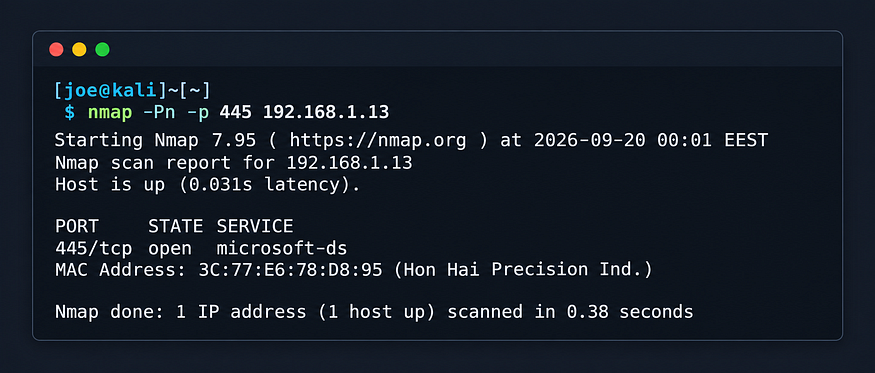
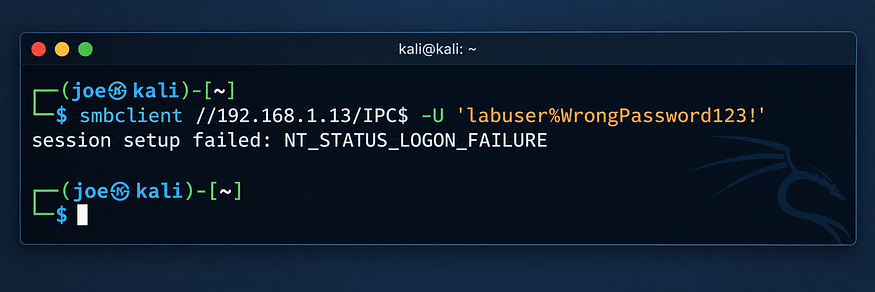
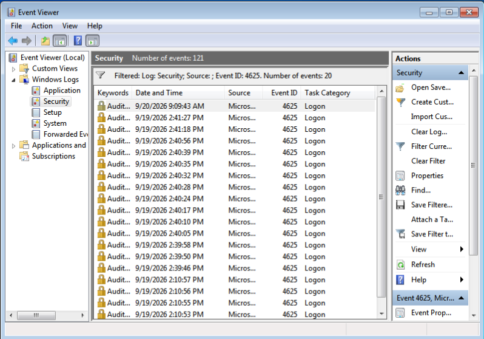
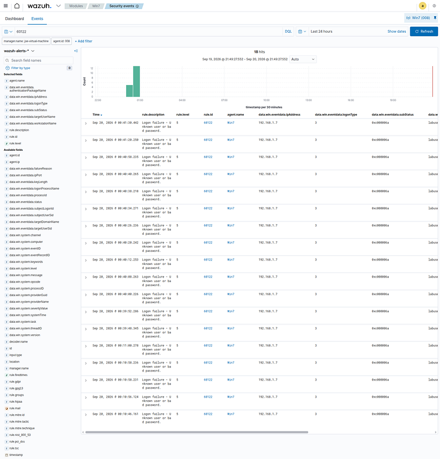
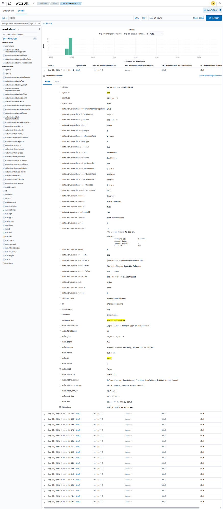
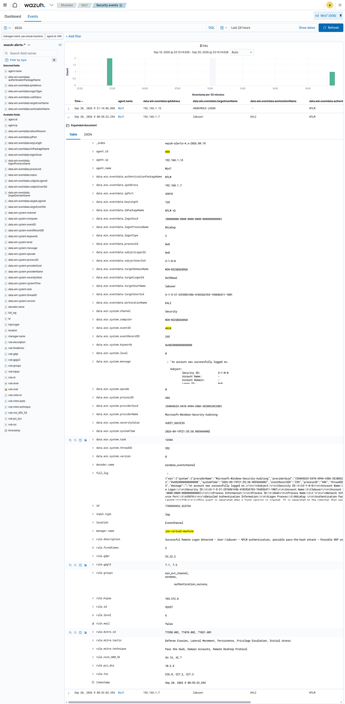
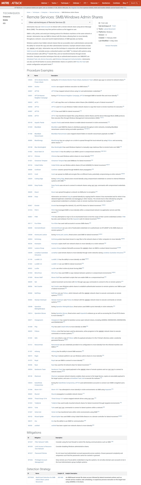

# Detecting SMB Brute-Force Activity with Wazuh

A SOC home lab demonstrating SMB authentication attack simulation, Windows Security Event Log analysis, Wazuh detection, investigation, event correlation, and MITRE ATT&CK mapping.

## 📌 Project Overview

In this hands-on SOC home lab, I simulated repeated failed SMB authentication attempts against a Windows 7 endpoint and investigated the activity using Wazuh SIEM.

The objective was to practice a complete SOC investigation workflow:

> Attack → Detection → Investigation → Evidence → MITRE ATT&CK → Documentation

The investigation focused on Windows Security Events `4625` and `4624`, identifying the source and targeted account, analyzing the authentication method, and correlating failed and successful authentication events.

---

## 🏗️ Lab Environment

| Machine | Role | IP Address |
|---|---|---|
| Kali Linux | Attacker / Source | `192.168.1.7` |
| Windows 7 | Target / Endpoint | `192.168.1.13` |
| Ubuntu | Wazuh Manager | `192.168.1.12` |

### Technologies

- Kali Linux
- Windows 7
- Wazuh SIEM
- SMB
- Windows Security Event Logs
- Nmap
- smbclient
- MITRE ATT&CK

---

# 1. SMB Service Verification

Before starting the authentication simulation, I verified that SMB was accessible on the Windows 7 endpoint.

### Command

```bash
nmap -Pn -p 445 192.168.1.13
```

The scan confirmed:
```text
445/tcp open microsoft-ds
```
This confirmed that the SMB service was reachable on the target.

### Evidence
The Nmap scan provided evidence that TCP port `445` was open on the Windows 7 endpoint and that the Microsoft-DS (SMB) service was accessible.



### Result
TCP port 445 was open.
The Microsoft-DS (SMB) service was accessible on the Windows 7 endpoint.
The target was reachable from the Kali Linux machine.

Next Step
With SMB confirmed as accessible, the next step was to simulate SMB authentication attempts against the Windows 7 endpoint using the smbclient utility.

---

# 2. SMB Authentication Simulation

After confirming SMB availability, I used `smbclient` to interact with the Windows SMB service.

The lab intentionally generated multiple failed authentication attempts against the test account `labuser`.

### Command

```bash
smbclient //192.168.1.13/IPC$ -U 'labuser%Wrong Password123!'
```
The authentication attempt returned:

```text
NT_STATUS_LOGON_FAILURE
```
### Evidence

The Kali Linux terminal showed the SMB authentication attempt against the Windows 7 `IPC$` share. The failed authentication generated an `NT_STATUS_LOGON_FAILURE` response, confirming that the authentication attempt was unsuccessful.



### Result

The SMB authentication attempt failed as expected and generated a Windows Security Event ID `4625`, which was later detected by Wazuh.

### Next Step

The next step was to investigate the generated Windows Security Event ID `4625` and identify the source IP, targeted account, and logon type.

---

# 3. Windows Security Event ID 4625

Windows recorded the failed authentication attempts as Event ID `4625`.

The event provided important investigation details:

| Field | Value |
|---|---|
| Event ID | `4625` |
| Account | `labuser` |
| Source IP | `192.168.1.7` |
| Workstation | `KALI` |
| Logon Type | `3 - Network` |
| Authentication | `NTLM` |

The Logon Type `3` indicates a network logon, which is consistent with the SMB authentication activity performed in the lab.

### Result

The Windows Security log successfully recorded the failed SMB authentication attempt as Event ID `4625`, providing the source host, source IP address, targeted account, and authentication details required for further investigation.

### Evidence

The Windows Event Viewer captured Event ID `4625` and showed the failed authentication details, including the `labuser` account, `KALI` workstation, and source IP `192.168.1.7`.



### Next Step

The next step was to verify whether Wazuh successfully collected and detected the Windows Event ID `4625` and generated a corresponding security alert.

---

# 4. Wazuh Detection

The Windows events were collected by the Wazuh Agent and forwarded to the Wazuh Manager.

Wazuh detected the failed authentication activity using:

```text
Rule ID: 60122
Level: 5
Description: Logon failure - Unknown user or bad password.
```
During the simulation, multiple authentication failure events were observed in Wazuh.

### Result

Wazuh successfully received and detected the Windows Security Event ID 4625. The alert was triggered by Rule ID 60122, confirming that the failed authentication events were successfully collected and processed by the Wazuh Manager.

### Evidence



The Wazuh Security Events dashboard displayed the detected authentication failures and showed Rule ID 60122 with Level 5.

### Next Step

The next step was to analyze the Wazuh event details to identify the source IP address, workstation, targeted account, logon type, and authentication package.

---

# 5. Source and Target Investigation

The investigation established the following:

### Source
```text
Host: KALI
IP: 192.168.1.7
```
### Target
```text
Host: Windows 7
IP: 192.168.1.13
```
### Target Account
```text
labuser
```
The correlation between the source IP, workstation, and targeted account allowed the authentication alerts to be investigated as a specific activity rather than isolated failed-login events.

### Investigation Summary

| Investigation Item | Result |
|---|---|
| Source Host | `KALI` |
| Source IP | `192.168.1.7` |
| Target Host | Windows 7 |
| Target IP | `192.168.1.13` |
| Target Account | `labuser` |
| Protocol | SMB |
| Destination Port | `445/TCP` |
| Failed Event | `4625` |
| Logon Type | `3 - Network` |
| Authentication | `NTLM` |

### Result
The investigation identified `KALI` (`192.168.1.7`) as the source of the SMB authentication attempts against the Windows 7 endpoint (`192.168.1.13`). The targeted account was `labuser`, with the activity occurring over SMB on TCP port `445`.

### Evidence
The Wazuh event details provided the source IP, workstation name, targeted username, logon type, and authentication package used during the failed authentication activity.



### Next Step
The next step was to investigate the subsequent successful authentication and analyze Windows Security Event ID 4624 to correlate it with the previous failed authentication attempts.

---

# 6. Successful Authentication — Event ID 4624

After the failed authentication attempts, a valid authentication was performed using the test account.

Windows generated Event ID `4624`.

The event showed:

| Field | Value |
|---|---|
| Account | `labuser` |
| Logon Type | `3` |
| Workstation | `KALI` |
| Source IP | `192.168.1.7` |
| Authentication | `NTLM` |
| Package | `NTLM V2` |

This allowed the activity to be correlated as:

```text
4625 Failed Logon
        ↓
4625 Failed Logon
        ↓
4625 Failed Logon
        ↓
4624 Successful Logon
```

### Result
The successful authentication event was correlated with the previous failed authentication attempts from the same source and targeted account.

### Evidence

Windows Event Viewer captured Event ID `4624`, showing the successful network authentication from `KALI` (`192.168.1.7`) using the `labuser` account.



### Next Step
The next step was to build a timeline of the observed authentication events and correlate the failed and successful logons.

---

# 7. Investigation Timeline

The documented sequence of failed authentication attempts began around:

```text
19 September 2026 – 2:10:43 PM
```

The investigation identified:

```text
Source:
192.168.1.7 / KALI

Target:
192.168.1.13 / Windows 7

Account:
labuser

Protocol:
SMB

Port:
445/TCP

Logon Type:
3 - Network
```

### Result
The timeline showed multiple failed SMB authentication attempts originating from KALI (192.168.1.7) against the labuser account on the Windows 7 endpoint, followed by a successful authentication event.

### Evidence
The investigation timeline was reconstructed using the Windows Security Events 4625 (failed logon) and 4624 (successful logon), together with the corresponding Wazuh alerts.

### Next Step
The next step was to map the observed authentication activity to the relevant MITRE ATT&CK techniques.

---

# 8. MITRE ATT&CK Mapping

The observed behavior was mapped to relevant MITRE ATT&CK techniques.

## T1110 — Brute Force

The repeated failed authentication attempts against the same account, followed by a successful authentication from the same source, were consistent with the controlled password-guessing simulation performed in the lab.

## T1021.002 — SMB/Windows Admin Shares

The activity involved:

```text
SMB
TCP/445
IPC$
```
This is relevant to:
```text
T1021.002 — SMB/Windows Admin Shares
```
The evidence collected in this lab demonstrates SMB authentication/access to ```text IPC$ ```. It does not demonstrate remote command execution or confirmed lateral movement.

### Result

The observed SMB authentication activity was mapped to MITRE ATT&CK techniques `T1110 — Brute Force` and `T1021.002 — SMB/Windows Admin Shares`. The evidence supports a controlled password-guessing simulation and SMB authentication/access to `IPC$`.

### Evidence

The investigation evidence included the repeated failed authentication events (`4625`), the successful authentication event (`4624`), and the SMB activity over TCP port `445`.



### Next Step
The next step was to document the collected evidence and summarize the key findings from the investigation.

---

# 9. Evidence Collected

The investigation produced the following evidence:

### Evidence 1 — SMB Service Verification

```text
TCP/445 → Open
```

### Evidence 2 — SMB Authentication Activity
```text
Kali → Windows 7
```
### Evidence 3 — Windows Event ID 4625
```text
Failed authentication
User: labuser
Source: 192.168.1.7
```
### Evidence 4 — Wazuh Alert
```text
Rule ID: 60122
Level: 5
```
### Evidence 5 — Windows Event ID 4624
```text
Successful authentication
User: labuser
Source: 192.168.1.7
```
### Evidence 6 — MITRE ATT&CK Mapping
```text
T1110
T1021.002
```
---
